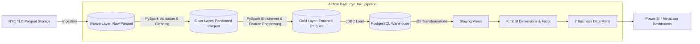

# 🚖 NYC Taxi Analytics Platform


An **End-to-End Batch ETL Data Platform** designed to ingest, process, transform, and analyze NYC Yellow Taxi trip records (2024–2025). The platform leverages the **Medallion Architecture**, **PySpark**, **PostgreSQL Data Warehouse**, **dbt (Data Build Tool)**, **Apache Airflow**, and **Metabase/PowerBI**.

---

## 📌 Table of Contents
- [Architecture](#-architecture)
- [Tech Stack](#-tech-stack)
- [Project Layout](#-project-layout)
- [Data Pipeline Layers](#-data-pipeline-layers)
- [dbt Star Schema & Business Data Marts](#-dbt-star-schema--business-data-marts)
- [Quick Start](#-quick-start)
- [Pipeline Execution](#-pipeline-execution)

---

## 🏗 Architecture

The platform uses a **Medallion Architecture** (Bronze → Silver → Gold) to continuously refine raw trip records into analytical data marts:



---

## 🛠 Tech Stack

| Layer | Technology | Purpose |
|---|---|---|
| **Data Ingestion** | Python (`requests`) | Ingests monthly Parquet files (~20–25M rows) |
| **Data Processing** | Apache Spark (PySpark 3.5) | Data validation, outlier filtering, feature engineering |
| **Storage Layer** | Parquet (Medallion) | Bronze (Raw), Silver (Cleaned), Gold (Enriched) partitioned by `year/month` |
| **Data Warehouse** | PostgreSQL 15 | Relational data warehouse serving gold analytics tables |
| **Transformation** | dbt (data build tool) | Data modeling into Kimball Star Schema & 7 Business Data Marts |
| **Orchestration** | Apache Airflow 2.9 | Automated end-to-end DAG execution |
| **Containerization** | Docker & Docker Compose | Containerized Airflow Webserver, Scheduler, and Metabase BI |
| **Visualization** | Power BI / Metabase | Interactive business dashboards and analytics reporting |

---

## 📂 Project Layout

```
nyc_taxi_platform/
├── dags/
│   └── nyc_taxi_pipeline.py         # Airflow DAG workflow definition
├── spark/
│   ├── bronze_to_silver.py          # PySpark: Validation & Outlier Removal
│   └── silver_to_gold.py            # PySpark: Feature Engineering & Warehouse Load
├── ingestion/
│   └── download_data.py             # Data ingestion script for NYC TLC Parquet files
├── dbt/
│   ├── models/
│   │   ├── staging/                 # Staging views (stg_trips, stg_zones)
│   │   ├── dimensions/              # Dimension tables (dim_location, dim_time)
│   │   ├── facts/                   # Fact tables (fact_trips)
│   │   └── marts/                   # 7 Business Data Marts
│   │       ├── mart_monthly_trends.sql
│   │       ├── mart_hourly_demand.sql
│   │       ├── mart_day_of_week.sql
│   │       ├── mart_revenue_by_zone.sql
│   │       ├── mart_route_analysis.sql
│   │       ├── mart_airport_vs_city.sql
│   │       └── mart_payment_insights.sql
│   ├── dbt_project.yml              # dbt configuration & materializations
│   └── profiles.yml                 # Connection profiles for dbt
├── data/
│   ├── bronze/                      # Raw ingested files
│   ├── silver/                      # Cleaned partitioned files
│   ├── gold/                        # Enriched partitioned files
│   └── taxi_zone_lookup.csv         # NYC Borough & Zone reference data
├── Dockerfile                       # Airflow container build specification
├── docker-compose.yml               # Multi-container service definitions
├── requirements.txt                 # Python package dependencies
└── .env.example                     # Environment template file
```

---

## 🔄 Data Pipeline Layers

### 1. Ingestion (`ingestion/download_data.py`)
- Fetches monthly Yellow Taxi trip records (2024–2025) from NYC TLC.
- Saves raw `.parquet` files in `data/bronze/year=YYYY/month=MM/`.

### 2. Bronze → Silver Layer (`spark/bronze_to_silver.py`)
- **Validation**: Ensures `PULocationID` and `DOLocationID` exist within valid ranges `[1, 265]`.
- **Outlier Filtering**:
  - Distance: `0 < trip_distance <= 500` miles.
  - Fare Amount: `0 < fare_amount < $1,000`.
  - Passengers: `1 <= passenger_count <= 8`.
  - Pickup Timestamps: Restricted to valid timeframe (`2024-01-01` to `2025-12-31`).
- **Output**: Partitioned Parquet files written to `data/silver/`.

### 3. Silver → Gold Layer (`spark/silver_to_gold.py`)
- **Enrichment**: `LEFT JOIN` with `taxi_zone_lookup.csv` for zone and borough details.
- **Feature Engineering**:
  - `trip_duration_min`: Trip duration calculated in minutes.
  - `tip_percentage`: Tip relative to fare amount (`(tip_amount / fare_amount) * 100`).
  - `speed_mph`: Average speed calculated in miles per hour.
  - Temporal Attributes: Hour of day, day of week.
- **Warehouse Load**: Partitioned Parquet output to `data/gold/` and JDBC load into PostgreSQL (`gold.trips`).

---

## 📊 dbt Star Schema & Business Data Marts

`dbt` builds a **Kimball Star Schema** over the PostgreSQL data warehouse:

- **Staging Layer** (`materialized='view'`):
  - `stg_trips`: Formatted trip records with cleaned column names and generated surrogate trip IDs.
  - `stg_zones`: Taxi location lookup views.
- **Dimensions & Facts** (`materialized='table'`):
  - `dim_location`: Location ID, borough, zone, and service zone attributes.
  - `dim_time`: Pickup timestamp granularity, hour, day of week, day name, and weekend indicators.
  - `fact_trips`: Key numerical trip metrics (distance, duration, fare, tip, total amount, speed).

- **7 Business Data Marts** (`materialized='table'`):
  1. `mart_monthly_trends`: Month-over-month comparison of trip counts, total revenue, and average trip distance (2024 vs 2025).
  2. `mart_hourly_demand`: Hourly demand, trip count, average fare, duration, and speed across 24 hours per borough.
  3. `mart_day_of_week`: Trip volume and revenue performance broken down by day of the week (Monday–Sunday) & Weekday vs Weekend.
  4. `mart_revenue_by_zone`: Total revenue, trip volume, base fare, and average tip percentage grouped by pickup zone.
  5. `mart_route_analysis`: Origin-Destination (OD) route matrix (Pickup Zone → Dropoff Zone) measuring popular routes, speeds, and travel durations.
  6. `mart_airport_vs_city`: Comparative analysis between Airport trips (JFK, Newark, LaGuardia) and City trips, capturing airport fees and fare margins.
  7. `mart_payment_insights`: Revenue, tip distribution, and average fare metrics categorized by payment methods (Credit Card, Cash, No Charge, Dispute).

---

## 🚀 Quick Start

### Prerequisites
- [Docker & Docker Compose](https://docs.docker.com/get-docker/)
- Python 3.10+

### 1. Environment Setup
Clone the repository and copy the environment template:
```bash
git clone https://github.com/NhatNamPhan/NYC_Taxi_Platform.git
cd nyc_taxi_platform

# Copy environment template
cp .env.example .env
```

Edit `.env` to configure database credentials if necessary.

### 2. Start Infrastructure
Run Docker Compose to start Airflow and Metabase services:
```bash
docker-compose up -d
```

Service URLs:
- **Airflow Webserver**: [http://localhost:8080](http://localhost:8080)
- **Metabase BI**: [http://localhost:3000](http://localhost:3000)

---

## ⚙️ Pipeline Execution

### Executing dbt Transformations
Navigate into the `dbt` directory and run:

```bash
cd dbt

# Build all seeds, models, and run tests
dbt build

# Or run models directly
dbt run

# Run only business data marts
dbt run --select marts
```

### Automated Execution via Airflow
Log in to Airflow at `http://localhost:8080` and enable/trigger the DAG:
```bash
# Trigger the DAG via Airflow CLI inside container or local environment
airflow dags trigger nyc_taxi_pipeline
```

The DAG runs the end-to-end task sequence:
1. `download_data_bronze`
2. `spark_bronze_to_silver`
3. `spark_silver_to_gold`
4. `dbt_transform_marts`

---

## 📜 License
Distributed under the MIT License.
