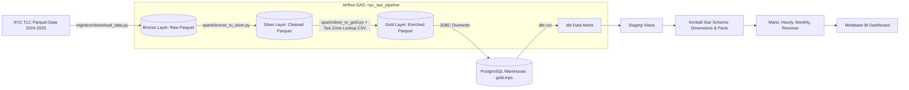

# 🚖 NYC Taxi Analytics Platform


An **End-to-End Data Engineering Batch ETL Pipeline** for processing and analyzing NYC Yellow Taxi trip records (2024–2025). Built using **Medallion Architecture**, **PySpark**, **Apache Airflow**, **dbt**, **PostgreSQL**, and **Metabase**.

---

## 📌 Table of Contents
- [Architecture](#-architecture)
- [Tech Stack](#-tech-stack)
- [Project Structure](#-project-structure)
- [Data Pipeline Layers](#-data-pipeline-layers)
- [dbt Data Modeling](#-dbt-data-modeling)
- [Quick Start & Setup](#-quick-start--setup)
- [Airflow Orchestration](#-airflow-orchestration)
- [Environment Variables](#-environment-variables)

---

## 🏗 Architecture

The platform follows the **Medallion Architecture** pattern to progressively clean, enrich, transform, and aggregate raw taxi trip records for analytics:



---

## 🛠 Tech Stack

| Layer / Process | Tool / Framework | Role & Description |
|---|---|---|
| **Data Ingestion** | Python (`requests`) | Downloads 24 monthly Parquet trip files (~20-25M rows) |
| **Batch Processing** | Apache Spark (PySpark 3.5) | Distributed data validation, outlier removal, enrichment & feature engineering |
| **Storage & Lakehouse** | Parquet (Medallion) | Bronze (Raw), Silver (Cleaned), Gold (Enriched) partitioned by `year/month` |
| **Data Warehouse** | PostgreSQL 15 | Serves processed Gold tables and dbt data marts |
| **Transformation** | dbt (data build tool) | Models data into Kimball Star Schema (Staging, Dimensions, Facts, Marts) |
| **Orchestration** | Apache Airflow 2.9 | Automated end-to-end DAG execution (`download` → `silver` → `gold` → `dbt`) |
| **Containerization** | Docker & Docker Compose | Containerized Airflow Webserver, Scheduler, and Metabase BI |
| **Visualization** | Metabase | Interactive dashboards and business intelligence reporting |

---

## 📂 Project Structure

```
nyc_taxi_platform/
├── dags/
│   └── nyc_taxi_pipeline.py         # Airflow DAG defining execution workflow
├── spark/
│   ├── bronze_to_silver.py          # PySpark job: Validation & Outlier Cleaning
│   └── silver_to_gold.py            # PySpark job: Feature Engineering & JDBC Load
├── ingestion/
│   └── download_data.py             # Downloader script for NYC TLC Parquet files
├── dbt/
│   ├── models/
│   │   ├── staging/                 # dbt Views for raw staging
│   │   ├── dimensions/              # dim_location, dim_time
│   │   ├── facts/                   # fact_trips
│   │   └── marts/                   # mart_hourly_demand, mart_monthly_trends, mart_revenue_by_zone
│   ├── dbt_project.yml              # dbt project configuration & materializations
│   └── profiles.yml                 # dbt connection profile for PostgreSQL
├── data/
│   ├── bronze/                      # Partitioned raw data files
│   ├── silver/                      # Partitioned cleaned data files
│   ├── gold/                        # Partitioned enriched data files
│   └── taxi_zone_lookup.csv         # Lookup table for NYC Boroughs & Zones
├── Dockerfile                       # Airflow container build configuration
├── docker-compose.yml               # Service setup for Airflow & Metabase
├── requirements.txt                 # Python dependencies
├── .env                             # Environment configuration
└── README.md                        # Documentation
```

---

## 🔄 Data Pipeline Layers

### 1. Ingestion (`ingestion/download_data.py`)
- Fetches monthly Yellow Taxi `.parquet` files for 2024–2025 directly from NYC TLC web storage.
- Stores files in `data/bronze/year=YYYY/month=MM/`.

### 2. Bronze → Silver (`spark/bronze_to_silver.py`)
- **Data Quality & Validation**:
  - Sanitizes `PULocationID` & `DOLocationID` (maps values outside `[1, 265]` to `NULL`).
  - Removes outliers and clock errors:
    - `0 < trip_distance <= 500` miles
    - `0 < fare_amount < $1,000`
    - `1 <= passenger_count <= 8`
    - `tip_amount >= 0`
    - Pickup datetime strictly within `2024-01-01` to `2025-12-31`.
- **Output**: Partitioned Parquet stored in `data/silver/`.

### 3. Silver → Gold (`spark/silver_to_gold.py`)
- **Data Enrichment & Feature Engineering**:
  - `LEFT JOIN` with `taxi_zone_lookup.csv` to attach `pickup_zone_name` and `pickup_borough`.
  - Calculates `trip_duration_min` (trip length in minutes).
  - Calculates `tip_percentage` (`(tip_amount / fare_amount) * 100`).
  - Calculates `speed_mph` (`trip_distance / duration_hours`).
  - Extracts temporal attributes (`hour`, `day_of_week`).
- **Warehouse Load**: Writes enriched DataFrame to Parquet (`data/gold/`) and overwrites table `gold.trips` in PostgreSQL via JDBC.

---

## 📊 dbt Data Modeling

`dbt` transforms `gold.trips` into a **Kimball Star Schema**:

- **Staging Layer** (`materialized='view'`):
  - `stg_trips`, `stg_zones`: Cleaned view wrappers.
- **Dimensions & Facts Layer** (`materialized='table'`):
  - `dim_location`: Surrogate key, borough, zone, service zone.
  - `dim_time`: Hour, day of week, weekend indicator.
  - `fact_trips`: Key metrics (fare, tip, distance, duration, speed).
- **Data Marts Layer** (`materialized='table'`):
  - `mart_hourly_demand`: Aggregated pickup count, average speed, and average fare by hour & day of week.
  - `mart_monthly_trends`: Monthly trip counts, total revenue, average tip percentage.
  - `mart_revenue_by_zone`: Total revenue, total trips, and average fare per taxi zone.

---

## 🚀 Quick Start & Setup

### Prerequisites
- Python 3.10+
- PostgreSQL 15+ running on port `5433` (or configured via `.env`)
- Docker & Docker Compose
- Java 8/11/17 (Required for PySpark local execution)

### 1. Clone & Environment Configuration
```bash
git clone https://github.com/NhatNamPhan/NYC_Taxi_Platform.git
cd nyc_taxi_platform

# Create virtual environment
python -m venv .venv
source .venv/bin/activate  # On Windows: .venv\Scripts\activate

# Install dependencies
pip install -r requirements.txt
```

Create a `.env` file in the root directory:
```env
DB_HOST=localhost
DB_PORT=5433
DB_NAME=nyc_taxi
DB_USER=postgres
DB_PASSWORD=1234
```

### 2. Start Services with Docker
```bash
docker-compose up -d
```
Services deployed:
- **Airflow Webserver**: [http://localhost:8080](http://localhost:8080)
- **Metabase BI**: [http://localhost:3000](http://localhost:3000)

### 3. Run Ingestion & Manual Spark Pipeline
```bash
# Step 1: Download raw data
python ingestion/download_data.py

# Step 2: Run Spark Bronze to Silver
python spark/bronze_to_silver.py

# Step 3: Run Spark Silver to Gold
python spark/silver_to_gold.py

# Step 4: Run dbt Transformations
cd dbt
dbt run --profiles-dir .
```

---

## ⚙️ Airflow Orchestration

Access Airflow at `http://localhost:8080` (Default credentials: `airflow / airflow` or auto-login depending on `.env`).

The DAG `nyc_taxi_pipeline` automates all 4 steps sequentially:
1. `download_data_bronze` (`BashOperator`)
2. `spark_bronze_to_silver` (`BashOperator`)
3. `spark_silver_to_gold` (`BashOperator`)
4. `dbt_transform_marts` (`BashOperator`)

To trigger manually via Airflow CLI:
```bash
airflow dags trigger nyc_taxi_pipeline
```

---

## 📈 Metabase BI Integration

1. Open `http://localhost:3000` in your browser.
2. Add PostgreSQL Database connection using host `host.docker.internal` (or container IP), database `nyc_taxi`.
3. Build dashboards using tables from the `marts` schema:
   - Demand heatmaps by hour and pickup location.
   - Monthly revenue and tip percentage trends.
   - Top revenue-generating taxi zones in NYC.

---

## 📜 License
Distributed under the MIT License. See `LICENSE` for more information.
